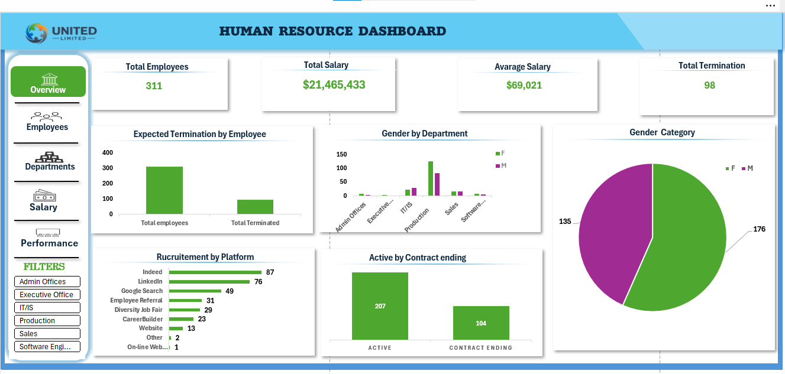
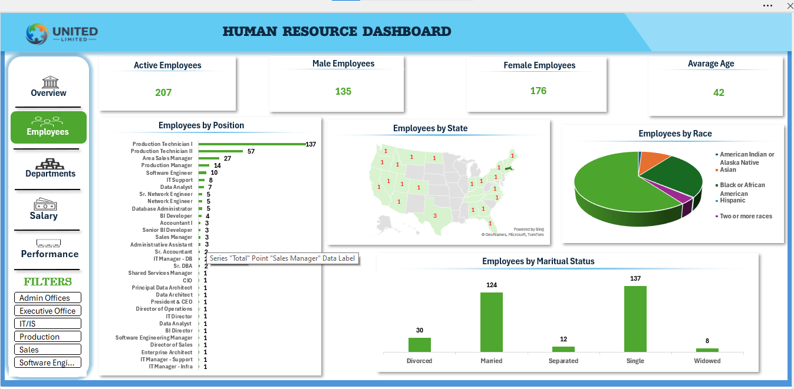
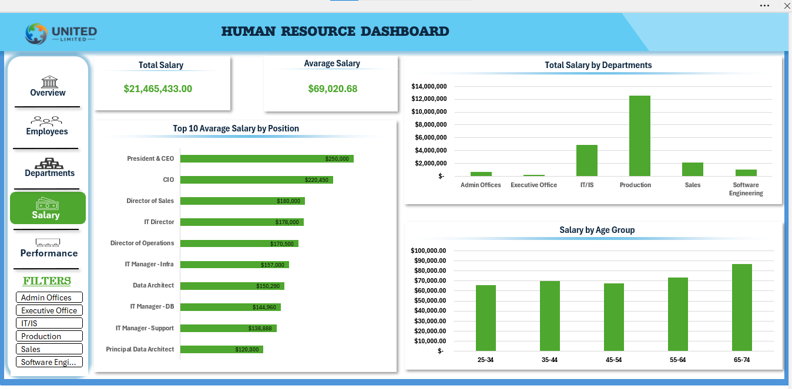
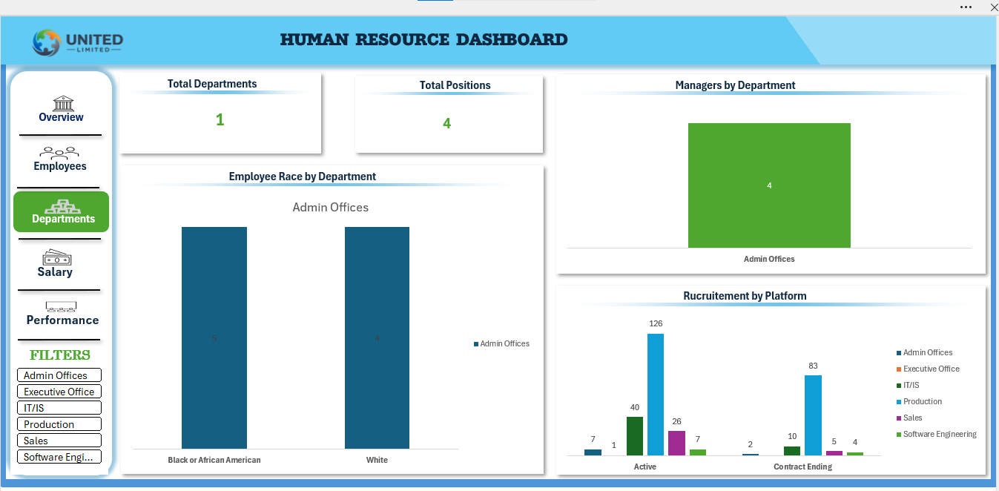
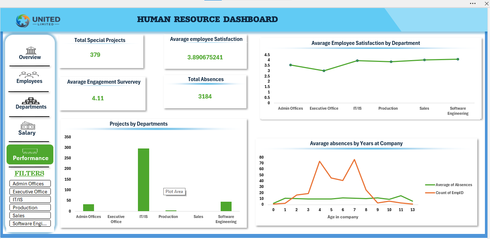

# 📊 HR Analytics Dashboard — Excel

**Turning Employee Data into Actionable HR Insights**

## 📌 Project Overview

This project is an HR Analytics Dashboard built using Microsoft Excel to transform employee data into clear, meaningful, and actionable insights.

HR departments manage large amounts of employee information. Without proper analysis, it can be difficult to identify workforce patterns, understand salary structures, compare departments, and evaluate employee performance.

This dashboard provides HR with a visual and interactive way to analyze employee data and support data-driven decision-making.

---

## 📊 1. Dashboard Overview

The Dashboard Overview provides a high-level summary of the organization's workforce using key HR metrics and visualizations.

**📸 Dashboard Screenshot**



### 💡 Why HR Needs This

HR managers need a quick way to understand the overall state of their workforce without manually going through large employee datasets.

The overview dashboard brings the most important information together in one place, allowing HR to quickly:

- Monitor key workforce indicators
- Identify important patterns
- Compare major HR metrics
- Get a quick picture of the organization
- Identify areas that require deeper analysis

This makes the dashboard a starting point for HR decision-making.

---

## 👥 2. Employees

The Employees section provides an analysis of the organization's employee population and workforce characteristics.

**📸 Employees Dashboard Screenshot**



### 💡 Why HR Needs This

Employee data is at the center of HR operations.

Analyzing employee information allows HR to understand who makes up the workforce and how employees are distributed across different categories.

This can help HR with:

- Workforce planning
- Understanding employee distribution
- Identifying workforce patterns
- Resource allocation
- Making informed staffing decisions

Instead of viewing employees as individual rows in a spreadsheet, HR can use the dashboard to identify patterns across the entire workforce.

---

## 💰 3. Salary

The Salary section analyzes employee compensation and salary patterns within the organization.

**📸 Salary Dashboard Screenshot**



### 💡 Why HR Needs This

Salary information is an important part of workforce management and organizational budgeting.

Salary analysis helps HR understand how compensation is distributed and identify patterns that may require further investigation.

It can support:

- Compensation planning
- Salary budgeting
- Understanding salary distribution
- Comparing compensation across employee groups
- Identifying potential salary imbalances

By visualizing salary information, HR can move beyond individual salary records and understand broader compensation patterns across the organization.

---

## 🏢 4. Department

The Department section analyzes how employees are distributed across different departments.

**📸 Department Dashboard Screenshot**



### 💡 Why HR Needs This

Different departments have different workforce requirements.

Understanding how employees are distributed across departments helps HR determine where the workforce is concentrated and where staffing levels may require further attention.

This analysis can support:

- Workforce planning
- Recruitment decisions
- Resource allocation
- Departmental comparisons
- Identification of staffing patterns

For example, if one department has significantly more employees than another, HR can investigate whether this reflects the organization's operational requirements.

---

## 📈 5. Performance

The Performance section provides insights into employee performance within the organization.

**📸 Performance Dashboard Screenshot**



### 💡 Why HR Needs This

Employee performance is an important factor in understanding organizational effectiveness.

Performance analysis allows HR and management to identify patterns in employee performance and determine areas that may require further attention.

It can support:

- Performance management
- Employee development
- Training decisions
- Recognition of high-performing employees
- Identification of areas requiring improvement
- Better workforce planning

Instead of relying only on individual performance records, HR can use visual analysis to identify broader performance patterns across employees and departments.

---

## 🔄 From Data to HR Decisions

The dashboard demonstrates how raw employee data can be transformed into useful HR insights:

```
Raw Employee Data
        ↓
   Data Analysis
        ↓
   Visualization
        ↓
     Insights
        ↓
 HR Decision Making
```

---

# 🎯 Key Takeaway

This project demonstrates how **HR employee data into an interactive analytics dashboard.**

The five dashboard sections provide different perspectives of the workforce:

| Dashboard | HR Purpose |
|---|---|
| 📊 Overview | Understand the overall workforce |
| 👥 Employees | Analyze employee information |
| 💰 Salary | Understand compensation patterns |
| 🏢 Department | Compare workforce distribution |
| 📈 Performance | Analyze employee performance |

### **Employee Data → Insights → Better HR Decisions**
